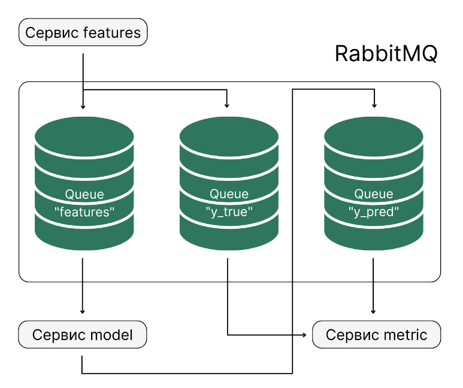

# PROJECT-4. Microservice architecture using RabbitMQ

## Оглавление  
* [1. Описание проекта](README.md#Описание-проекта)
* [3. Установка](README.md#Установка-и-запуск)
* [3. Результаты](README.md#Результаты)    

## Описание проекта    

Реализуем несколько сервисов:

- Первый будет (features) отправлять признаки в одну очередь и истинный ответ — в другую.

Сервис имитирует клиентскую часть ML-приложения, которая в бесконечном цикле выбирает случайные объекты из выборки (Для каждого из n = 442 пациентов с диабетом были получены десять исходных переменных, возраст, пол, индекс массы тела, среднее артериальное давление и шесть измерений сыворотки крови, а также интересующий ответ — количественный показатель прогрессирования заболевания через год после исходного уровня. [sklearn.datasets diabet](https://scikit-learn.ru/7-1-toy-datasets/?ysclid=lqqhlk85qo42338031) ) и отправляет вектор признаков на сервис, на котором функционирует модель, а значение правильного ответа на сервис вычисления метрик.
- Второй сервис (model) будет читать признаки, делать предсказание и отправлять его в очередь с предсказаниями.
- Третий сервис (metric) будет читать очереди с истинными ответами и предсказаниями. 
Сервис имитирует подсистему логирования работы нашей модели.

 С её помощью мы можем фиксировать результаты работы модели и сравнивать их с истинными показателями: например, мы можем определять абсолютную ошибку между истиной и предсказанием, следить за изменением этой ошибки во времени, усреднять её и так далее.
- Четвертый сервис (plot) Данный сервис должен в бесконечном цикле читать таблицу metric_log.csv и строить график распределения (гистограмму) абсолютных ошибок. 
- также отдельно запущен сервис непосредственно с самим брокером очереди 

Схематично описанную архитектуру можно представить в следующем виде:


Проект имеет следущую структуру файлов: директории features, plot, model и metric, соответствующие каждому сервису. Внутри каждой из этих директорий находится по папке src, в которой хранится исходный код: features.py, model.py, plot.py и metric.py, Dockerfile для сборки контейнера с сервисом и requirements.txt с описанием необходимых библиотек. Также в папке model/src/  находится файл с сериализованной моделью.  Директория ./logs/ будет примонтирована к ФС контейнера для сервисов metric и plot, для сохранения логов работы очереди (labels_log.txt), предсказаний модели (файл metric_log.csv, в нём будет храниться таблица со следующими столбцами: id, y_true, y_pred, absolute_error) и построенных графиков (error_distribution.png) распределения абсолютной ошибки предсказания модели.
```
microservice_architecture
├── docker-compose.yml
├── features
│   ├── Dockerfile
│   ├── requirements.txt
│   └── src
│       └── features.py
├── logs
│   ├── error_distribution.png
│   ├── labels_log.txt
│   └── metric_log.csv
├── metric
│   ├── Dockerfile
│   ├── requirements.txt
│   └── src
│       └── metric.py
├── model
│   ├── Dockerfile
│   ├── requirements.txt
│   └── src
│       ├── model.py
│       └── myfile.pkl
└── plot
    ├── Dockerfile
    ├── requirements.txt
    └── src
        └── plot.py

```

[к оглавлению](README.md#Оглавление)

### Установка и запуск

Для запуска микросервисного приложения у Вас должен быть установлен docker и docker-compose (при необходимости установить согласно оф. документации: [docker](https://docs.docker.com/engine/install/), [docker-compose](https://docs.docker.com/compose/install/standalone/)):
 
- Загрузить основную директорию проекта на компьютер или клонировать репозиторий
- Сменить директорию в терминале на microservice_architecture
- Для сборки контейнеров с сервисами запустить в нём команду: `$ docker-compose build`
- Для запуска в фоновом режиме: `$ docker-compose up -d` 

[к оглавлению](README.md#Оглавление)

### Результаты

Конечно, полученные микросервисы «игрушечные» —  например, микросервис с клиентской частью приложения должен содержать хотя бы минимальный графический интерфейс, на микросервисе с моделью должна быть предусмотрена предобработка данных перед подачей в модель (она может быть зашита в виде pipeline в pickle-файле с моделью) и ещё много нюансов. Но цель этого учебного проекта для меня, была в знакоместве с работой брокеров асинхронных очередей для обеспечения работы микросервисов как аналогичный вариает их взаимодействия при использование асинхронных запросов http + свзяки NGINX+uWSGI+FLASK.

[к оглавлению](README.md#Оглавление)


